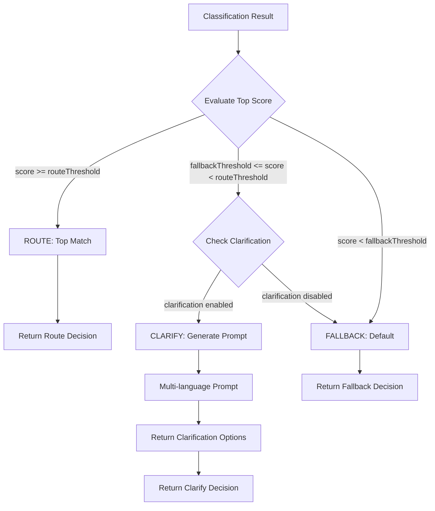

# Architecture: Confidence Router

## System Overview

Confidence Router is a decision engine that processes classification results with confidence scores and determines the appropriate routing action: route to the top match, request clarification, or fall back to a default handler.

## High-Level Architecture

```
┌─────────────────┐    ┌──────────────────┐    ┌─────────────────┐
│   Classifier    │───▶│  Decision Engine │───▶│ Routing Decision│
│   (Pluggable)   │    │   (Core Logic)   │    │   (Output)      │
└─────────────────┘    └──────────────────┘    └─────────────────┘
         │                       │                       │
         ▼                       ▼                       ▼
┌─────────────────┐    ┌──────────────────┐    ┌─────────────────┐
│ Confidence      │    │  Configuration   │    │ Response        │
│ Scores          │    │  (Thresholds)    │    │ Formatter       │
└─────────────────┘    └──────────────────┘    └─────────────────┘
```

## Core Components

### 1. Decision Engine

The heart of the system, responsible for evaluating confidence scores against configurable thresholds.

#### Decision Tree Logic

```
                    ┌─────────────────┐
                    │ Classification  │
                    │     Result      │
                    └────────┬────────┘
                             │
                    ┌────────▼────────┐
                    │ Top Confidence  │
                    │     Score       │
                    └────────┬────────┘
                             │
                ┌─────────────┼─────────────┐
                │             │             │
    ┌───────────▼──┐ ┌────────▼────────┐ ┌─▼────────────┐
    │ Score >=     │ │ Score in        │ │ Score <      │
    │ Route        │ │ Clarification   │ │ Fallback     │
    │ Threshold    │ │ Range           │ │ Threshold    │
    └───────────┬──┘ └────────┬────────┘ └─┬────────────┘
                │             │             │
    ┌───────────▼──┐ ┌────────▼────────┐ ┌─▼────────────┐
    │ ROUTE        │ │ CLARIFY       │ │ FALLBACK     │
    │ to top match │ │ ask user      │ │ to default   │
    └──────────────┘ └───────────────┘ └──────────────┘
```

#### Decision Flow Diagram



### 2. Configuration System

Manages all configurable parameters for the routing system.

#### Configuration Structure

```typescript
interface RouterConfig {
  // Thresholds
  routeThreshold: number;        // Score >= routeThreshold → ROUTE
  fallbackThreshold: number;     // Score < fallbackThreshold → FALLBACK
  clarificationEnabled: boolean; // Enable/disable clarification
  
  // Clarification settings
  clarificationLanguages: string[]; // ISO 639-1 codes
  clarificationPromptTemplate?: string;
  maxClarificationOptions?: number;
  
  // Classifier settings
  defaultClassifier: string;
  // Fallback settings
  fallbackHandler?: FallbackHandler;
  
  // Evaluation settings
  evalMode?: boolean;
  metricsCollector?: MetricsCollector;
}
```

### 3. Pluggable Classifier System

Supports multiple classifier types with a unified interface.

#### Classifier Interface

```typescript
interface Classifier {
  name: string;
  type: 'llm' | 'embedding' | 'keyword' | 'custom';
  
  classify(input: string, context?: any): Promise<ClassificationResult>;
  validate(): Promise<boolean>;
  getMetrics(): ClassifierMetrics;
}

interface ClassificationResult {
  predictions: Prediction[];
  metadata?: {
    model?: string;
    latency?: number;
    tokens?: number;
  } & Record<string, unknown>;
}

interface Prediction {
  label: string;
  confidence: number;
  metadata?: Record<string, unknown>;
}
```

#### Built-in Classifiers

1. **LLM Classifier**
   - Uses OpenAI/Anthropic APIs
   - Returns structured predictions with confidence scores
   - Supports few-shot learning

2. **Embedding Similarity Classifier**
   - Vector-based similarity matching
   - Uses cosine similarity for confidence calculation
   - Supports multiple embedding models

3. **Keyword Classifier**
   - Pattern matching approach
   - Rule-based confidence scoring
   - Fast and deterministic

### 4. Multi-Language Support System

Provides clarification prompts in 45+ languages.

#### Language Configuration

```typescript
interface LanguageConfig {
  code: string; // ISO 639-1
  name: string;
  clarificationTemplates: {
    basic: string;
    detailed: string;
    options: string;
  };
  formatting: {
    listSeparator: string;
    questionEnding: string;
    politeForm: boolean;
  };
}
```

#### Supported Languages (45+)

- **Major Languages**: English, Spanish, French, German, Italian, Portuguese, Dutch, Russian, Japanese, Korean, Chinese (Simplified & Traditional), Arabic
- **European Languages**: Polish, Swedish, Norwegian, Danish, Finnish, Czech, Slovak, Hungarian, Romanian, Bulgarian, Croatian, Serbian, Slovenian, Greek, Turkish
- **Asian Languages**: Hindi, Bengali, Tamil, Telugu, Marathi, Gujarati, Kannada, Malayalam, Thai, Vietnamese, Indonesian, Malay, Filipino
- **Other Languages**: Hebrew, Persian, Urdu, Swahili, Afrikaans

### 5. Evaluation Harness

Provides tools for tuning thresholds and measuring performance.

#### Evaluation Components

```typescript
interface EvaluationDataset {
  examples: LabeledExample[];
  metadata: DatasetMetadata;
}

interface LabeledExample {
  input: string;
  expectedLabel: string;
  expectedConfidence?: number;
  context?: Record<string, unknown>;
}

interface EvaluationMetrics {
  accuracy: number;
  precision: number;
  recall: number;
  f1Score: number;
  confusionMatrix: ConfusionMatrix;
  thresholdAnalysis: ThresholdAnalysis;
}
```

#### Optimization Workflow

```
┌─────────────────┐    ┌──────────────────┐    ┌─────────────────┐
│ Labeled Dataset │───▶│ Threshold Grid   │───▶│ Performance     │
│                 │    │ Search           │    │ Metrics         │
└─────────────────┘    └──────────────────┘    └────────┬────────┘
                                                        │
                                                        ▼
┌─────────────────┐    ┌──────────────────┐    ┌─────────────────┐
│ Optimal         │◀───│ Cross-Validation │◀───│ Threshold       │
│ Thresholds      │    │                  │    │ Candidates      │
└─────────────────┘    └──────────────────┘    └─────────────────┘
```

## Data Flow

### 1. Routing Decision Flow

```typescript
// Input
const classificationResult: ClassificationResult = {
  predictions: [
    { label: 'intent_a', confidence: 0.85 },
    { label: 'intent_b', confidence: 0.12 },
    { label: 'intent_c', confidence: 0.03 }
  ]
};

// Processing
const decision = await router.decide(classificationResult);

// Output
if (decision.type === 'ROUTE') {
  // decision.target = 'intent_a'
} else if (decision.type === 'CLARIFY') {
  // decision.prompt = "Did you mean: intent_a or intent_b?"
  // decision.options = ['intent_a', 'intent_b']
} else if (decision.type === 'FALLBACK') {
  // decision.handler = defaultFallbackHandler
}
```

### 2. Clarification Generation Flow

```
Classification Result
        │
        ▼
┌──────────────────┐
│ Get Top N        │
│ Predictions      │
└────────┬─────────┘
         │
         ▼
┌──────────────────┐
│ Filter by        │
│ Confidence       │
└────────┬─────────┘
         │
         ▼
┌──────────────────┐
│ Select Language  │
│ Template         │
└────────┬─────────┘
         │
         ▼
┌──────────────────┐
│ Generate         │
│ Localized Prompt │
└──────────────────┘
```

## API Design

### Main Router Class

```typescript
class ConfidenceRouter {
  constructor(config: RouterConfig);
  
  // Core routing method
  decide(classification: ClassificationResult): Promise<RoutingDecision>;
  
  // Batch processing
  decideBatch(classifications: ClassificationResult[]): Promise<RoutingDecision[]>;
  
  // Configuration management
  updateConfig(config: Partial<RouterConfig>): void;
  getConfig(): RouterConfig;
  
  // Evaluation methods
  evaluate(dataset: EvaluationDataset): Promise<EvaluationMetrics>;
  optimizeThresholds(dataset: EvaluationDataset): Promise<OptimizedThresholds>;
  
  // Classifier management
  registerClassifier(classifier: Classifier): void;
  getClassifier(name: string): Classifier;
}
```

### Factory Pattern

```typescript
class RouterFactory {
  static create(config: RouterConfig): ConfidenceRouter;
  static createWithDefaults(): ConfidenceRouter;
}
```

## Error Handling Strategy

### Error Types

```typescript
enum RouterErrorType {
  CONFIGURATION_ERROR = 'CONFIGURATION_ERROR',
  CLASSIFICATION_ERROR = 'CLASSIFICATION_ERROR',
  LANGUAGE_NOT_SUPPORTED = 'LANGUAGE_NOT_SUPPORTED',
  THRESHOLD_INVALID = 'THRESHOLD_INVALID',
  CLASSIFIER_NOT_FOUND = 'CLASSIFIER_NOT_FOUND'
}

class RouterError extends Error {
  type: RouterErrorType;
  code: string;
  details?: Record<string, unknown>;
}
```

### Threshold Validation

The router validates threshold configuration on initialization to ensure logical consistency:

```typescript
// Validation: must maintain fallback < route
if (config.fallbackThreshold >= config.routeThreshold) {
  throw new RouterError(
    RouterErrorType.THRESHOLD_INVALID,
    'fallbackThreshold must be strictly less than routeThreshold'
  );
}
```

### Error Recovery

1. **Configuration Errors**: Fall back to default configuration
2. **Classifier Errors**: Use fallback classifier or default handler
3. **Language Errors**: Fall back to English prompts
4. **Threshold Errors**: Use safe default thresholds

## Performance Considerations

### Optimization Strategies

1. **Caching**: Cache classification results and decisions
2. **Batching**: Support batch processing for efficiency
3. **Lazy Loading**: Load language packs on demand
4. **Connection Pooling**: Reuse classifier connections

### Performance Targets

- **Decision Time**: <10ms (core logic)
- **Memory Usage**: <50MB baseline
- **Concurrent Requests**: 1000+ requests/second
- **Bundle Size**: <100KB gzipped

## Security Considerations

### Input Validation

- Validate all classification results
- Sanitize user inputs for classifiers
- Validate configuration parameters
- Rate limit external API calls

### Data Protection

- Secure handling of API keys
- Encrypt sensitive configuration
- Implement proper access controls
- Audit logging for decisions

## Monitoring & Observability

### Metrics Collection

```typescript
interface RouterMetrics {
  decisionsTotal: number;
  decisionsByType: {
    route: number;
    clarify: number;
    fallback: number;
  };
  avgDecisionTime: number;
  errorRate: number;
  classifierUsage: Record<string, number>;
}
```

### Logging Strategy

- Structured JSON logging
- Decision audit trail
- Performance metrics logging
- Error tracking and alerting

## Deployment Architecture

### Package Distribution

The library is distributed as a dual ESM/CJS package via npm:

```json
// package.json
{
  "name": "confidence-router",
  "type": "module",
  "main": "./dist/index.cjs",
  "module": "./dist/index.js",
  "types": "./dist/index.d.ts",
  "exports": {
    ".": {
      "import": "./dist/index.js",
      "require": "./dist/index.cjs",
      "types": "./dist/index.d.ts"
    }
  }
}
```

### Recommended Deployment

As a library, `confidence-router` is embedded in consumer applications. For a hosted decision service:

```
┌─────────────────┐    ┌──────────────────┐
│ Load Balancer   │    │ Configuration    │
│                 │    │ Service          │
└────────┬────────┘    └──────────────────┘
         │
    ┌────┴────┐
    │         │
┌───▼───┐ ┌──▼────┐
│Router │ │Router │  (Horizontal Scaling)
│Node 1 │ │Node 2 │
└───┬───┘ └──┬────┘
    │         │
    └────┬────┘
         │
    ┌────┴─────┐
    │          │
┌───▼──┐ ┌────▼────┐
│Redis │ │Database │  (Caching & Persistence)
└──────┘ └─────────┘
```

### Environment Configuration

```bash
# Required
ROUTER_ROUTE_THRESHOLD=0.8
ROUTER_FALLBACK_THRESHOLD=0.3
ROUTER_DEFAULT_CLASSIFIER=llm

# Optional
ROUTER_LANGUAGES=en,es,fr,de
ROUTER_EVAL_MODE=false
ROUTER_LOG_LEVEL=info
```

## Testing Strategy

### Test Categories

1. **Unit Tests**: Core logic, thresholds, decision engine
2. **Integration Tests**: Classifier integration, language system
3. **Performance Tests**: Load testing, stress testing
4. **Evaluation Tests**: Threshold optimization, metrics accuracy

### Test Coverage Goals

- **Unit Tests**: >95% coverage
- **Integration Tests**: All critical paths
- **E2E Tests**: Complete workflows

## Future Extensibility

### Plugin Architecture

```typescript
interface RouterPlugin {
  name: string;
  version: string;
  
  beforeDecide?(context: DecisionContext): Promise<void>;
  afterDecide?(context: DecisionContext, decision: RoutingDecision): Promise<void>;
  onError?(error: RouterError): Promise<void>;
}
```

### Extension Points

1. **Custom Classifiers**: Implement Classifier interface
2. **Custom Prompts**: Provide language templates
3. **Custom Handlers**: Implement fallback handlers
4. **Custom Metrics**: Extend metrics collection

## Conclusion

This architecture provides a robust, scalable, and extensible foundation for the Confidence Router system. The modular design allows for easy maintenance and future enhancements while maintaining high performance and reliability standards.

---

**Last Updated**: 2026-04-22  
**Version**: 1.0.0  
**Status**: v0.1.0 Core Implemented — 99%+ test coverage, build passing
